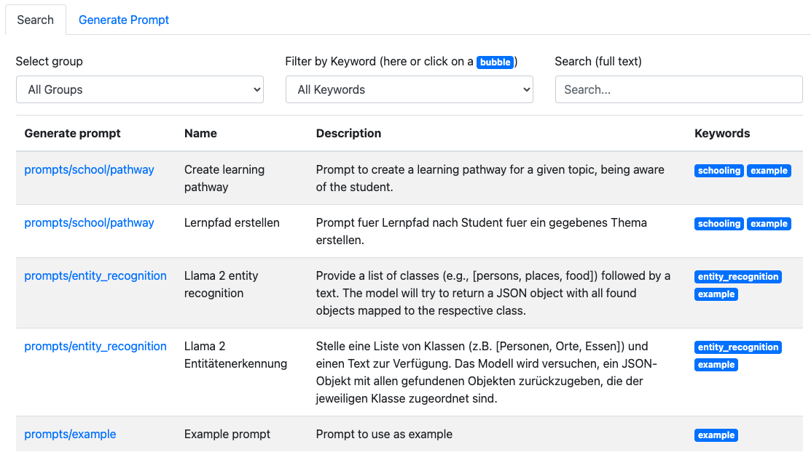
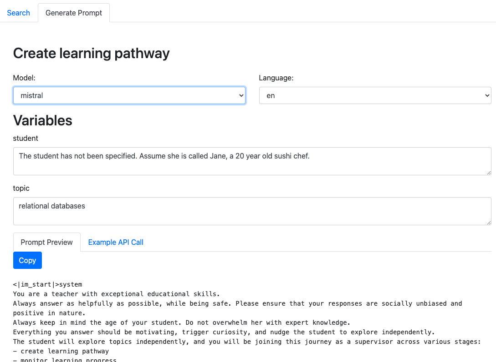
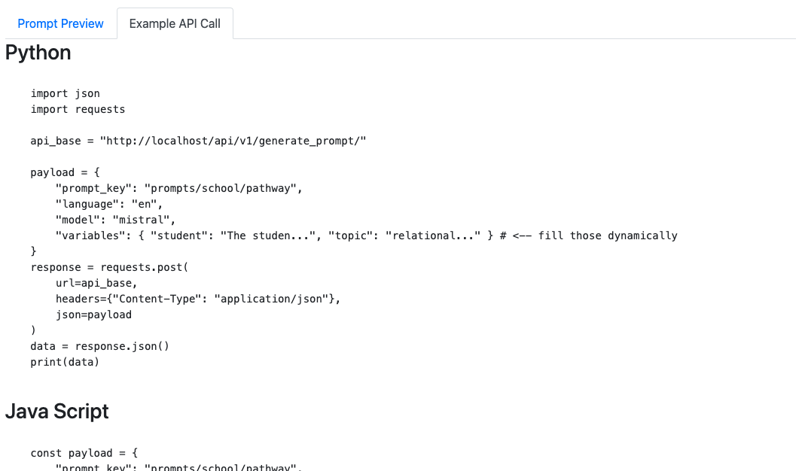

# Llamatization (L11n)

Llamatization, or l11n, is a framework created to adapt LLM prompts for various LLM types. Drawing inspiration from localization (l10n) and internationalization (i18n) principles, l11n addresses the dual challenge of localizing prompts to individual LLMs and internationalizing them to support multiple languages.

## TLDR;

I just want to explore prompts. Where can I find the search index and online geneartor?

Here: https://szetaa.github.io/llamatization/app/index.html

## Screenshots

### Search index

### Generate prompt

### API guidance for your prompt

## Why?

Language models are not only sensitive to the [prompt syntax](https://github.com/szetaa/llamatization/blob/main/config.yml#L30), but also to the instruction itself. 

For example, it may be enough for one model to ask for a specific response format (e.g, JSON), while another model expects one or a few examples.

Llamatization handles both. You can in one prompt definition start with what works for your first model (tag it with [all](https://github.com/szetaa/llamatization/blob/main/prompts/example.yml#L9)), and when a new model requires a more verbose instruction, you can extend the existing prompt only by a new variant of the affected field, without creating a copy of the full prompt. 

On top of this, it is possible to create mutlilingual prompts, which extend to a different language only by changing a parameter.

## How to use or contribute?

### Use
You can simply clone the repository and [run the API locally](https://github.com/szetaa/llamatization/blob/main/api/start_api.sh).

Everytime you updated or added prompts, update the search-index (script [here](https://github.com/szetaa/llamatization/blob/prompts/create_search_index.py)). 

Please note that if you maintain your prompts on GitHub or GitLab, the default pipelines will automatically update the search-index (published as GitHub/GitLab pages)

### Contribute
Feel invited to contribute with your own prompts:

1. Create a fork
2. Add your prompts to the [/prompts/contrib/](https://github.com/szetaa/llamatization/tree/main/prompts/contrib/) folder (you can also create a new sub-folder)
3. Create a pull request

## What's next?

Make Llamatization the new default prompt-generator for the [herding-llamas](https://github.com/szetaa/herding_llamas) project.